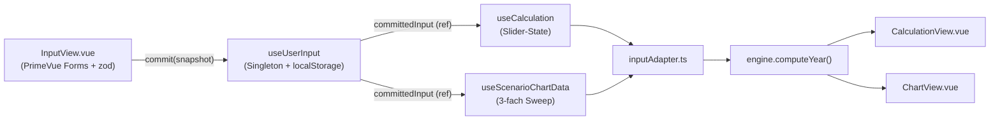

# 02 - Architektur

> **In 30 Sekunden:** Drei Schichten + strikt einseitiger Datenfluss. UI + State läuft ausschließlich über `useUserInput`. Berechnung ist ein **reiner, framework-freier** Layer in `src/calculation/`, vollständig unit-test-fähig.

## Verzeichnisstruktur

```text
frontend/src/
├── App.vue                 # Root-Layout (3-Spalten + Toolbar)
├── main.ts                 # Vue + PrimeVue + i18n + Tooltip-Init
├── style.css               # Tailwind + globale CSS-Variablen
├── views/                  # Top-level Routen-Pendants (3 Spalten)
│   ├── InputView.vue       # linke Spalte: Eingabeformular (PrimeVue Forms)
│   ├── CalculationView.vue # mittlere: Tabellen-Vergleich + Slider
│   └── ChartView.vue       # rechte: Chart.js Diagramm
├── components/             # Wiederverwendbare UI
│   ├── CalculationGroup.vue # eine Tabellengruppe in CalculationView
│   ├── EmptyStateOverlay.vue # Overlay wenn noch kein Snapshot existiert
│   └── ScenarioChart.vue   # Chart.js-Wrapper
├── composables/            # Vue-State-Logik (reactive)
│   ├── useUserInput.ts     # Singleton: localStorage-Snapshot, TTL 3h
│   ├── useCalculation.ts   # CalculationView-State + Slider
│   └── useScenarioChartData.ts # ChartView-Daten (3-fach kart. Produkt)
├── calculation/            # FRAMEWORK-FREIE BERECHNUNG (testbar)
│   ├── types.ts            # alle Interfaces (PersonProfile, ...)
│   ├── constants.ts        # 2026er Tarif-/SV-/Familien-Konstanten
│   ├── inputAdapter.ts     # UserInputSnapshot -> Engine-Inputs
│   └── engine.ts           # computeYear() + alle Steuerformeln
└── i18n/
    ├── index.ts            # vue-i18n Init (DE/ZH, Fallback DE)
    ├── de.ts               # Quelle der Übersetzungen
    └── zh.ts               # Strukturell 1:1 zu de.ts
```

## Drei Schichten

```text
┌──────────────────────────────────────────────────────────────┐
│ Presentation:   App.vue + views/* + components/*            │
│                  (PrimeVue, Tailwind, t() — KEINE Steuerlogik)
├──────────────────────────────────────────────────────────────┤
│ State / Glue:   composables/useUserInput | useCalculation   │
│                 | useScenarioChartData                      │
│                 (Vue refs, computed, watch, localStorage)   │
├──────────────────────────────────────────────────────────────┤
│ Domain:         calculation/types | constants | inputAdapter│
│                 | engine                                   │
│                 (REINE Funktionen, KEIN Vue, KEIN DOM,      │
│                  KEIN localStorage, KEIN async)             │
└──────────────────────────────────────────────────────────────┘
```

**Regel:** Domain-Layer importiert NICHTS aus den oberen Schichten. Verstöße werden bei Code-Review hart abgelehnt.

## Datenfluss (einseitig)



### Wichtige Eigenschaften

- **Tippen ändert die Berechnung NICHT.** `InputView` committet erst beim Klick auf „Daten speichern” (mit zod-Validierung). Bis dahin sehen Calculation/Chart entweder den letzten Snapshot oder ein `EmptyStateOverlay`.
- **Single Source of Truth** ist der `committedInput`-Ref in [`useUserInput.ts`](../../../frontend/src/composables/useUserInput.ts). Alles andere ist davon abgeleitet.
- **TTL 3 Stunden** im localStorage (`abfindungspilot.input.v1`). Nach Ablauf -> `EmptyStateOverlay`.
- **Slider in der `CalculationView`** sind eigener Komponenten-State (in `useCalculation`), getriggert keinen erneuten Commit.

## Datentypen-Pipeline

```text
UserInputSnapshot                 (composables/useUserInput.ts)
   │   │   └── inputAdapter.inputToProfileUser/Spouse, inputToIncomeUser/Spouse
   ▼
PersonProfile + PersonIncomeData  (calculation/types.ts)
   │   │   └── computePersonYear()
   ▼
PersonYearResult                  (income, sv, zvEwithoutKFB, …)
   │   │   └── computePersonTax()  oder  computeJointTax()
   ▼
PersonTaxResult / JointTaxResult  (assessedIncomeTax, soli, kirchensteuer)
   │   │   └── aggregiert in YearComputation
   ▼
YearComputation                   ← konsumiert von CalculationView / ChartView
```

Jeder Pfeil ist eine pure Funktion. Details siehe [03 - Berechnungs-Engine](./03-calculation-engine.md).

## Layout (App.vue)

3-Spalten-Grid mit zwei Toggle-Buttons:

| Spalte | Inhalt | Breite |
| --- | --- | --- |
| Links | InputView | 480 px (collapse → 0) |
| Mitte | CalculationView | flexibel |
| Rechts | ChartView | flexibel |
