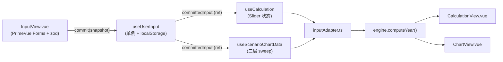

# 02 - 架构

> **30 秒了解：** 三层 + 严格单向数据流。UI 和 State 只通过 `useUserInput`。计算层是**纯函数、无框架依赖**的 `src/calculation/`，可以完整做单元测试。

## 目录结构

```text
frontend/src/
├── App.vue                 # 根布局（三栏 + Toolbar）
├── main.ts                 # Vue + PrimeVue + i18n + Tooltip 初始化
├── style.css               # Tailwind + 全局 CSS 变量
├── views/                  # 顶层视图（三栏）
│   ├── InputView.vue       # 左栏：输入表单（PrimeVue Forms）
│   ├── CalculationView.vue # 中栏：表格对比 + Slider
│   └── ChartView.vue       # 右栏：Chart.js 图表
├── components/             # 可复用 UI
│   ├── CalculationGroup.vue # CalculationView 中的一个表格分组
│   ├── EmptyStateOverlay.vue # 尚无 snapshot 时的遮罩
│   └── ScenarioChart.vue   # Chart.js 包装
├── composables/            # Vue 响应式状态
│   ├── useUserInput.ts     # 单例：localStorage snapshot、3 小时 TTL
│   ├── useCalculation.ts   # CalculationView 状态 + Slider
│   └── useScenarioChartData.ts # ChartView 数据（三层笛卡尔积）
├── calculation/            # 无框架依赖的计算层（可测试）
│   ├── types.ts            # 所有接口（PersonProfile…）
│   ├── constants.ts        # 2026 税率/SV/家庭常量
│   ├── inputAdapter.ts     # UserInputSnapshot -> Engine 输入
│   └── engine.ts           # computeYear() + 全部税务公式
└── i18n/
    ├── index.ts            # vue-i18n 初始化 (DE/ZH, fallback DE)
    ├── de.ts               # 翻译源
    └── zh.ts               # 结构与 de.ts 1:1 对齐
```

## 三层

```text
┌──────────────────────────────────────────────────────────────┐
│ 表现层:   App.vue + views/* + components/*                  │
│          (PrimeVue, Tailwind, t() — 不含税务逻辑)            │
├──────────────────────────────────────────────────────────────┤
│ 状态/胶水: composables/useUserInput | useCalculation        │
│           | useScenarioChartData                            │
│           (Vue ref/computed/watch、localStorage)            │
├──────────────────────────────────────────────────────────────┤
│ 领域:     calculation/types | constants | inputAdapter      │
│           | engine                                           │
│           (纯函数；无 Vue、无 DOM、无 localStorage、无 async) │
└──────────────────────────────────────────────────────────────┘
```

**铁律：** 领域层不允许 import 上层任何东西。Code Review 见到必拒。

## 数据流（单向）



### 关键性质

- **打字不会改变计算结果。** `InputView` 只在点击“Daten speichern”时 commit（带 zod 校验）。在那之前，Calculation/Chart 看到的是上次 snapshot 或 **`EmptyStateOverlay`**。
- **唯一真相源** 是 [`useUserInput.ts`](../../../frontend/src/composables/useUserInput.ts) 的 `committedInput` ref。其它一切都是从它派生的。
- **3 小时 TTL** 存在 localStorage（`abfindungspilot.input.v1`）过期 -> `EmptyStateOverlay`。
- **`CalculationView` 的 Slider** 是组件本地状态（在 `useCalculation` 里），不会触发新 commit。

## 数据类型管线

```text
UserInputSnapshot                 (composables/useUserInput.ts)
   │   │   └── inputAdapter.inputToProfileUser/Spouse, inputToIncomeUser/Spouse
   ▼
PersonProfile + PersonIncomeData  (calculation/types.ts)
   │   │   └── computePersonYear()
   ▼
PersonYearResult                  (income, sv, zvEwithoutKFB, …)
   │   │   └── computePersonTax() 或 computeJointTax()
   ▼
PersonTaxResult / JointTaxResult  (assessedIncomeTax, soli, kirchensteuer)
   │   │   └── 汇总进 YearComputation
   ▼
YearComputation                   ← CalculationView / ChartView 消费
```

每个箭头都是纯函数。详情见 [03 - 计算引擎](./03-calculation-engine.md)。

## 布局 (App.vue)

三栏 grid + 两个切换按钮：

| 栏 | 内容 | 宽度 |
| --- | --- | --- |
| 左 | InputView | 480 px（折叠 → 0） |
| 中 | CalculationView | 自适应 |
| 右 | ChartView | 自适应 |

中栏和右栏 **“互斥”** 显示（同时只能一个）。顶部 Toolbar 的 `SelectButton`（multiple）让 `input` 独切换、`calculation` / `chart` 二选一。

## Empty-State 控制

| 条件 | 状态 |
| --- | --- |
| `committedInput === null`（App 启动、无 snapshot、或 TTL 过期） | `hasData = false` -> `EmptyStateOverlay` 盖住 CalculationView 和 ChartView |
| 有 snapshot | `hasData = true` -> 渲染真实数据 |

`hasData` 在 `App.vue`、`useCalculation.ts`、`useScenarioChartData.ts` 各自独立计算（都源自同一个 `committedInput`）。

## 持久化

只有 **一件事** 会持久化：

```ts
// useUserInput.ts
const STORAGE_KEY = 'abfindungspilot.input.v1';
const STORAGE_TTL_MS = 3 * 60 * 60 * 1000;
```

- 语言（DE/ZH）有 **独立** key `abfindungspilot.language.v1`（见 [`i18n/index.ts`](../../../frontend/src/i18n/index.ts)），无 TTL
- Slider 状态（`severancePaymentDate` 等）**不**持久化，新 snapshot 会重置为默认值
